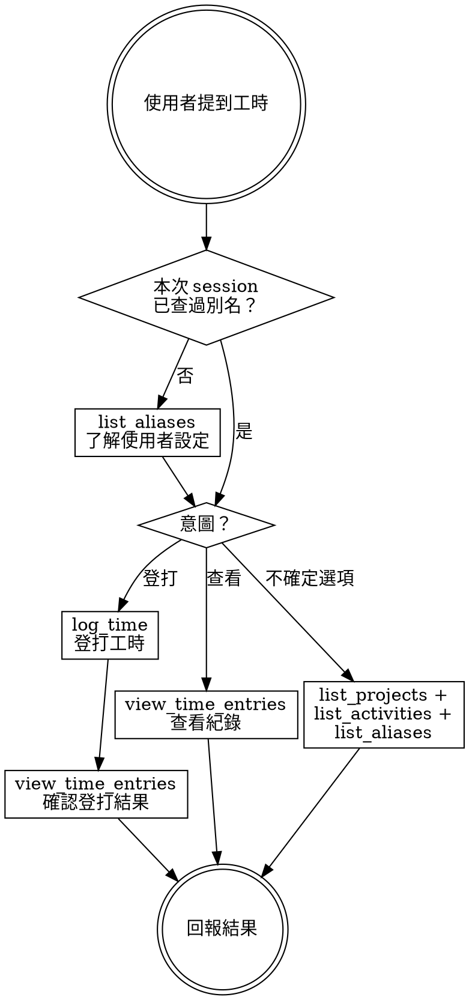

# Redmine 工時登打

透過 redmine-log MCP tools 操作 Redmine 工時。tools 支援別名與模糊匹配，但你需要先了解使用者的別名設定才能正確轉換參數。

## Workflow

**登打後一定要確認：** 每次 `log_time` 完成後，必須呼叫 `view_time_entries` 讓使用者看到登打結果。這是不可省略的步驟。確認時的 period 要對應登打日期：今天用 `"today"`，其他日期用 `"YYYY-MM-DD:YYYY-MM-DD"` 格式。

## 參數轉換

自然語言 → MCP tool 參數：

| 使用者說的 | 參數 | 值 |
|-----------|------|-----|
| 「4 小時」「4h」 | hours | "4h" |
| 「30 分鐘」「半小時」 | hours | "30m" |
| 「開發」「設計」「會議」 | activity | 直接傳入，MCP 會模糊匹配 |
| 「前端專案」「XX 專案」 | project | 直接傳入別名或名稱 |
| 「昨天」 | date | "yesterday" |
| 「3/15」 | date | "03/15" |
| 「這禮拜」「本週」 | period | "week"（不是 "this_week"） |
| 「今天」（或省略） | period/date | "today"（預設值） |

**period 只接受三種值：** `"today"`、`"week"`、`"YYYY-MM-DD:YYYY-MM-DD"`。不要用 `"this_week"`、`"yesterday"` 等變體。查昨天請用日期範圍格式。

## 多筆登打

使用者一次提到多筆工時時：
1. 逐筆呼叫 `log_time`（每筆獨立，不要合併）
2. **每筆的 comment 獨立對應，不要混用。** 例如「備註寫 sprint review + 新功能實作」→ 第一筆 comment="sprint review"，第二筆 comment="新功能實作"
3. 全部完成後呼叫一次 `view_time_entries` 確認所有結果

## Common Mistakes

- **忘了查別名：** 第一次處理工時請求前，一定先 `list_aliases`。別名可能把「前端」映射到完全不同的專案名
- **登完不確認：** 每次 `log_time` 後都要 `view_time_entries` 讓使用者看到結果
- **多筆共用 comment：** 使用者說「備註 A + B」時，A 和 B 通常分屬不同筆，別全塞到同一個 comment
- **period 格式錯誤：** 用了 `"this_week"` 而非 `"week"`，或用了不支援的格式
- **日期用絕對值：** 使用者說「昨天」時，直接傳 `"yesterday"` 給 date 參數，不需要自己算日期
